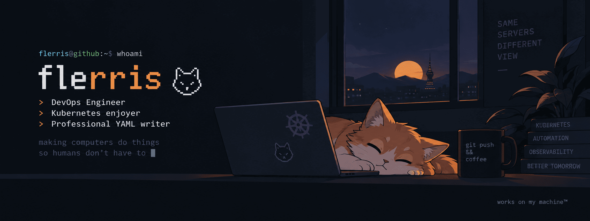

<p align="center">
  
</p>
<div align="center">

# `flerris 😸`

### DevOps Engineer ☁️ · Kubernetes enjoyer ☸️ · Professional YAML writer

*making computers do things so humans don't have to*

<br>


<br><br>

<sub>
Argo CD · Helm · Vault · Loki · Zabbix · Proxmox · MikroTik · ClickHouse · RabbitMQ · Talos
</sub>

<br><br>
<div align="left">

```text
╭─────────────────────────────────────────────────────────────────────╮
│                                                                     │
│  ☸️  Kubernetes   ███████████████████░   production                 │
│  🐍  Python       ███████████████░░░░░   when YAML isn't enough     │
│  🌐  Networking   ████████████████░░░░   probably DNS               │
│  🏠  Homelab      ████████████████████   unnecessarily complicated  │
│  ☕   Sleep        ███░░░░░░░░░░░░░░░░░   best effort                │
│                                                                     │
╰─────────────────────────────────────────────────────────────────────╯
```
</div>
### `~/now`

🦊 building **[egressfox](https://github.com/egressfox-io)**  
🔧 overengineering my homelab  
📚 doing a Master's in Applied Informatics

<br>

---

### `~/activity`

<!-- contribution snake -->
<picture>
  <source media="(prefers-color-scheme: dark)" srcset="https://raw.githubusercontent.com/flerris/flerris/output/github-contribution-grid-snake-dark.svg">
  <source media="(prefers-color-scheme: light)" srcset="https://raw.githubusercontent.com/flerris/flerris/output/github-contribution-grid-snake.svg">
  
</picture>

<br>


<br><br>

<sub>

**works on my machine** · **blame DNS** · **kubectl get problems -A**

</sub>

</div>
